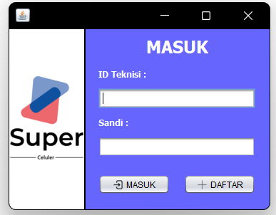
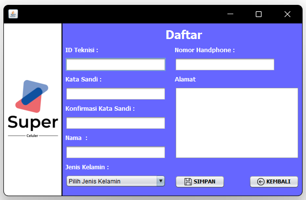
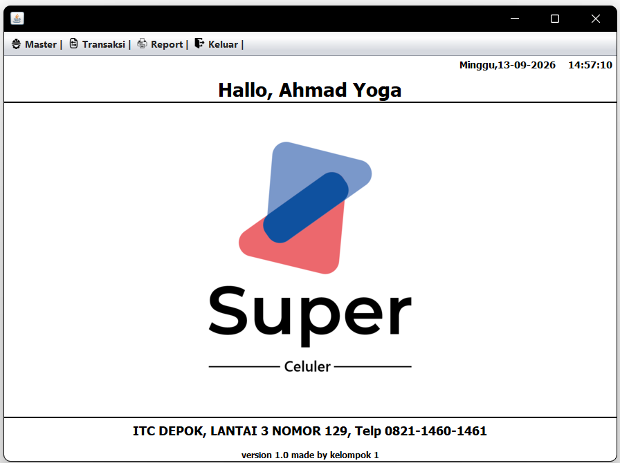
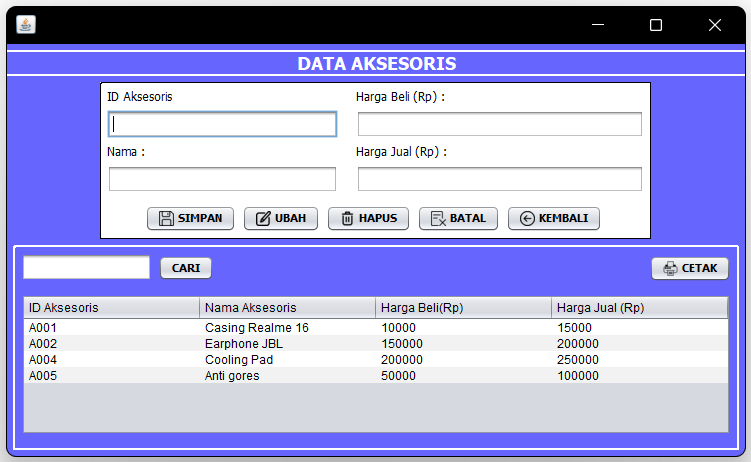
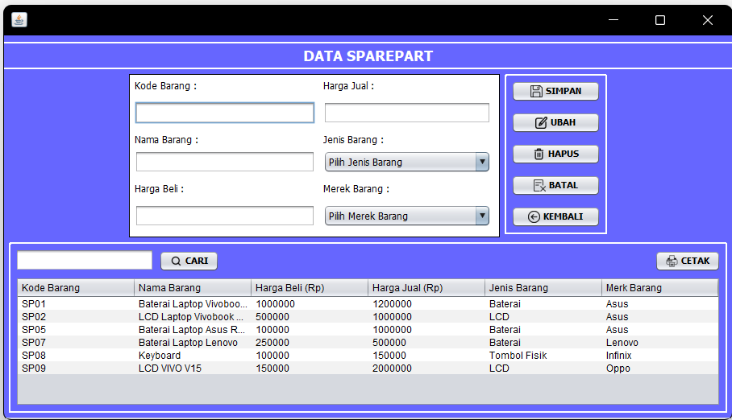
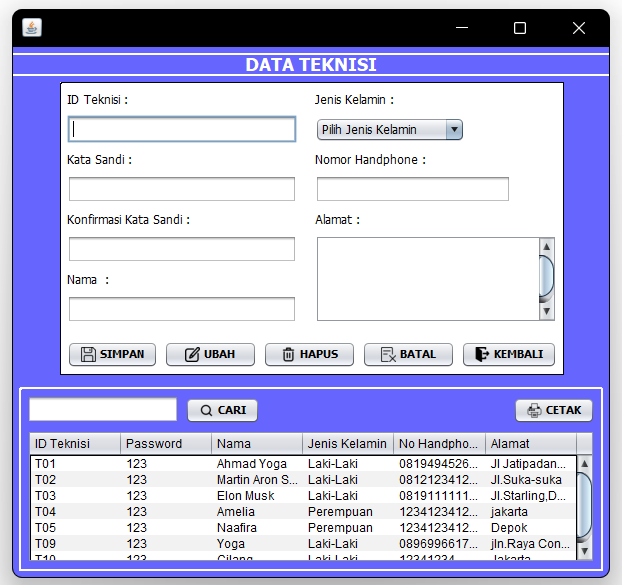
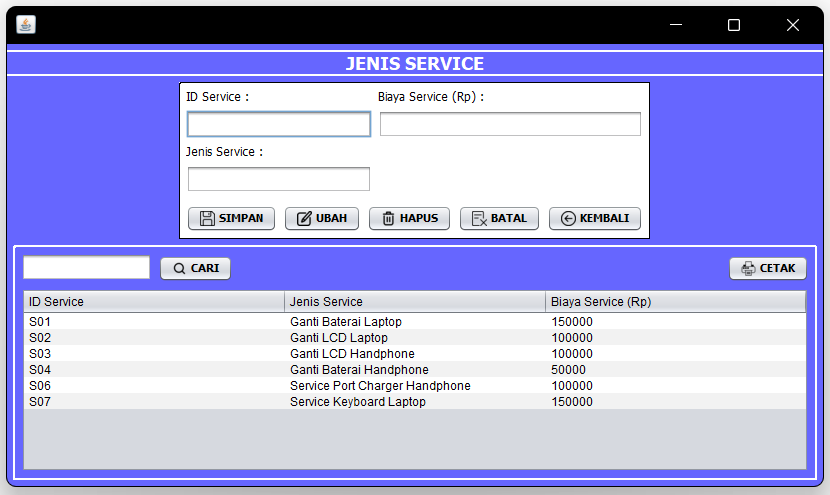
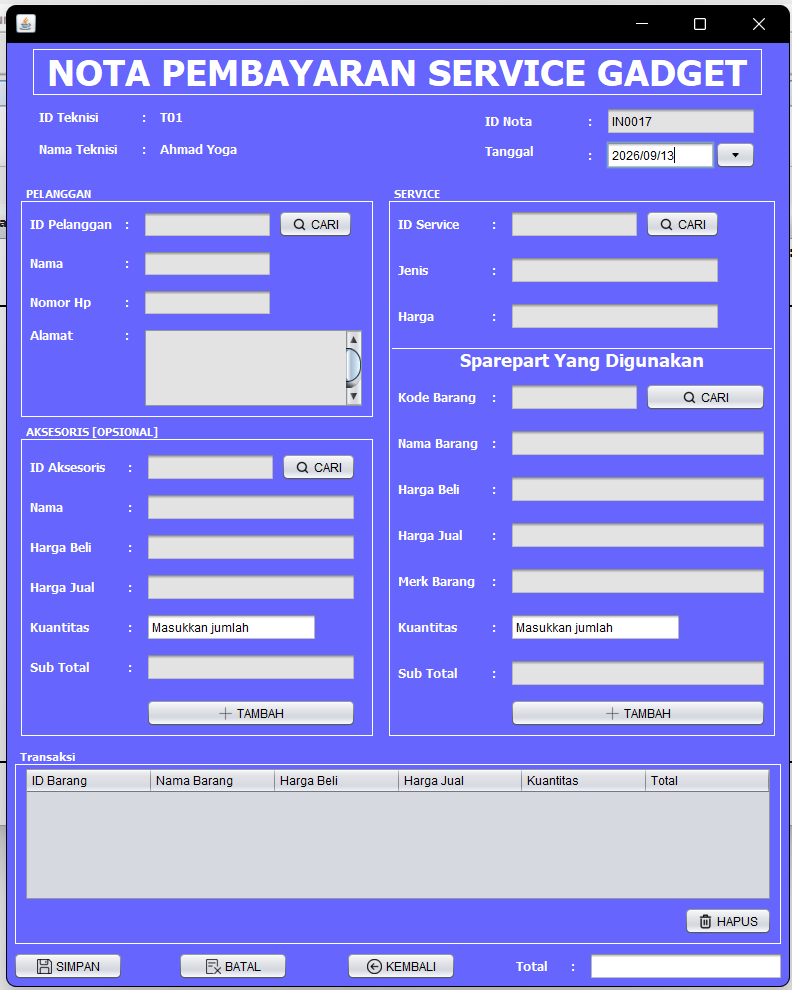
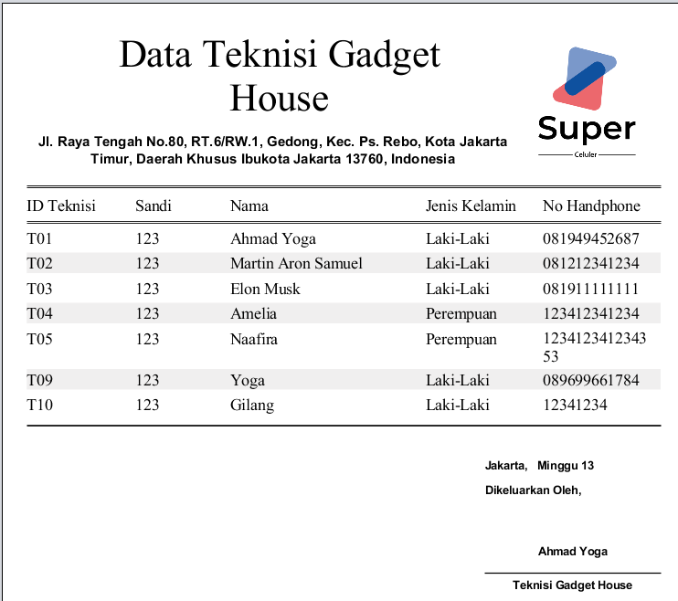

# Sistem Pelayanan Perbaikan dan Perawatan Gadget


Aplikasi desktop berbasis **Java** dan **MySQL** yang dirancang untuk membantu proses pelayanan service gadget pada **Super Celluler**. Sistem ini memudahkan pengelolaan data pelanggan, teknisi, aksesoris, sparepart, jenis service, serta transaksi pembayaran agar proses administrasi menjadi lebih rapi, cepat, dan terstruktur.

Proyek ini dibuat sebagai *academic project* pada studi Teknik Informatika dengan studi kasus **Super Celluler**.

## Tujuan Proyek

- Membantu pencatatan layanan service gadget secara terkomputerisasi.
- Mempermudah pengelolaan data pelanggan, teknisi, sparepart, dan aksesoris.
- Mengurangi kesalahan pencatatan serta mempercepat pencarian informasi layanan.
- Menyediakan data transaksi dan laporan yang lebih terstruktur untuk kebutuhan administrasi.

## Alur Sistem

Secara umum, proses pelayanan pada aplikasi berjalan melalui alur berikut:

```text
Kelola data master → Input transaksi service → Tambahkan sparepart/aksesoris → Hitung total pembayaran → Cetak data atau laporan
```

## Fitur Utama

| Fitur | Keterangan |
| --- | --- |
| Login dan registrasi | Memungkinkan teknisi masuk atau membuat akun untuk mengakses aplikasi. |
| Dashboard | Menampilkan menu utama untuk mengakses seluruh fungsi sistem. |
| Data pelanggan | Mengelola informasi pelanggan yang menggunakan layanan Super Celluler. |
| Data teknisi | Mengelola akun dan informasi teknisi yang menangani service. |
| Data aksesoris | Mengelola data serta harga beli dan jual aksesoris. |
| Data sparepart | Mengelola data, jenis, merek, serta harga sparepart. |
| Jenis service | Mengelola daftar jenis service dan biaya service. |
| Transaksi service | Mencatat nota pembayaran service, pelanggan, jenis service, aksesoris opsional, dan sparepart yang digunakan. |
| Cetak data | Mencetak data teknisi sebagai dokumen laporan. |

## Teknologi yang Digunakan

- **Bahasa pemrograman:** Java
- **Jenis aplikasi:** Desktop Application
- **IDE:** Apache NetBeans
- **Database:** MySQL
- **Konsep pengelolaan data:** CRUD (*Create, Read, Update, Delete*)

## Prasyarat

Sebelum menjalankan proyek, pastikan perangkat telah memiliki:

- Java Development Kit (JDK)
- Apache NetBeans
- MySQL Server
- MySQL Connector/J atau *driver* JDBC MySQL yang telah ditambahkan ke proyek

## Cara Menjalankan

1. Clone atau unduh repository ini.
2. Buka proyek melalui Apache NetBeans.
3. Buat database MySQL dan impor berkas SQL proyek apabila tersedia.
4. Sesuaikan konfigurasi koneksi database pada source code dengan akun dan nama database MySQL Anda.
5. Pastikan library MySQL Connector/J sudah terhubung pada proyek.
6. Jalankan proyek dari NetBeans.
7. Masuk menggunakan akun yang telah tersedia pada database aplikasi.

> **Catatan:** Nama database, akun pengguna, dan lokasi konfigurasi dapat berbeda sesuai struktur source code proyek yang digunakan.

## Akun Demo

| Field | Nilai |
| --- | --- |
| ID Teknisi | `T01` |
| Sandi | `123` |

> Akun demo ini sesuai dengan data yang terlihat pada dokumentasi aplikasi. Ganti sandi akun apabila aplikasi akan digunakan di luar lingkungan pengembangan.

## Dokumentasi Antarmuka

Simpan seluruh gambar yang digunakan di dalam folder `asset_tutor/` pada repository agar dokumentasi berikut dapat tampil di GitHub.

### 1. Login



### 2. Registrasi Teknisi



### 3. Menu Utama



### 4. Master Data Pelanggan


### 5. Master Data Aksesoris



### 6. Master Data Sparepart



### 7. Master Data Teknisi



### 8. Master Jenis Service



### 9. Transaksi Service



### 10. Contoh Cetak Data Teknisi



## Pengembangan Selanjutnya

Beberapa pengembangan yang dapat dilakukan pada proyek ini:

- Menambahkan status pengerjaan service secara lebih rinci, misalnya *menunggu*, *diproses*, dan *selesai*.
- Menambahkan notifikasi kepada pelanggan saat service telah selesai.
- Menyediakan fitur ekspor laporan layanan ke PDF.
- Menambahkan pengelolaan stok sparepart dan aksesoris secara otomatis.
- Mengembangkan aplikasi ke versi web atau mobile agar dapat diakses lebih fleksibel.

## Kontributor

**Ahmad Nur Latif Prayoga**  
Teknik Informatika — Universitas Indraprasta PGRI

---

Jika proyek ini bermanfaat, silakan berikan ⭐ pada repository ini.
